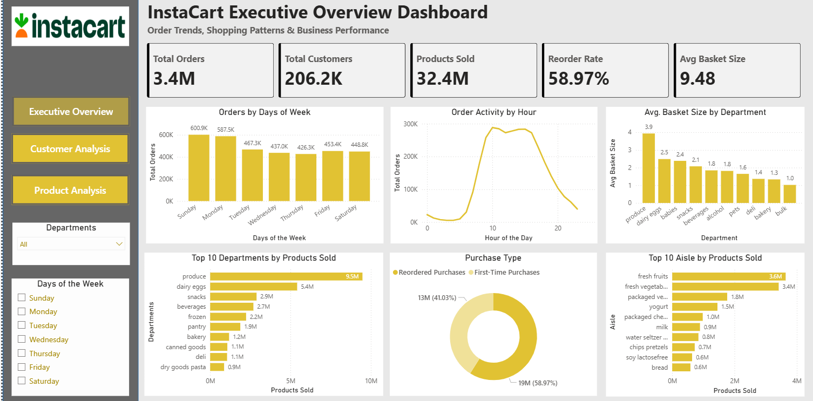
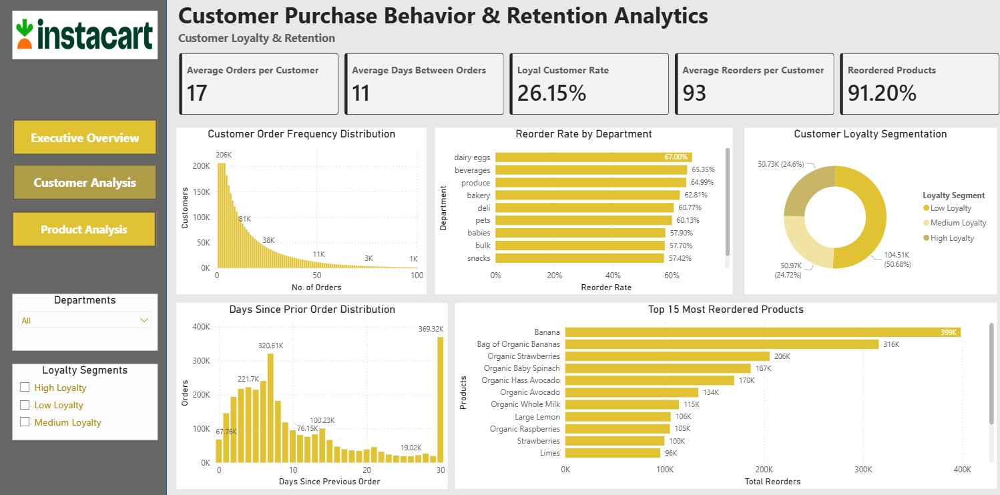
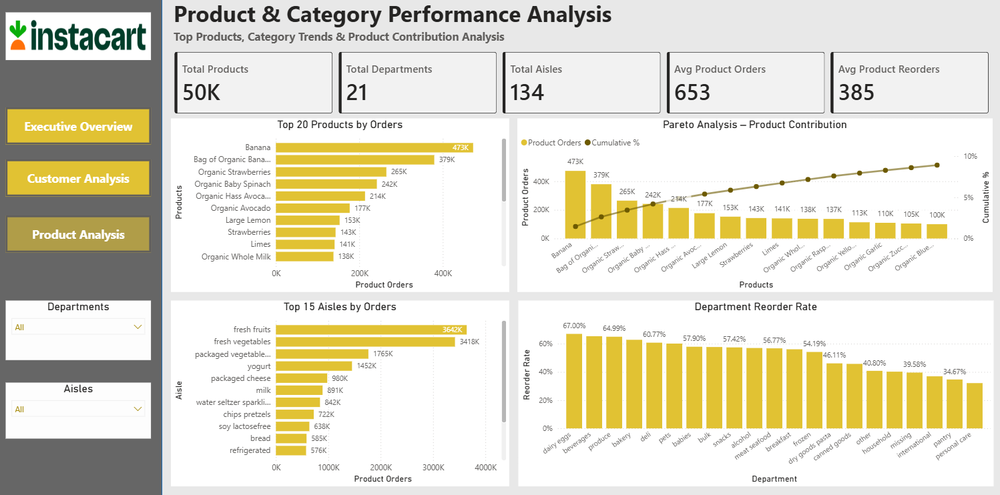

# Customer Retention and Loyalty Analytics Dashboard

## Overview

The **Customer Retention and Loyalty Analytics Project** is an end-to-end Business Intelligence solution developed using the **Instacart Market Basket Analysis** dataset. The project focuses on understanding customer purchasing behavior, measuring customer loyalty, identifying reorder patterns, and analyzing product and category performance through interactive Power BI dashboards.

The project demonstrates the complete data analytics workflow—from data cleaning and transformation to SQL-based analysis and dashboard development—providing actionable insights that can support customer retention strategies and business decision-making.

---

## Problem Statement

Understanding customer behavior is essential for improving retention and increasing repeat purchases. Businesses need to identify loyal customers, analyze reorder behavior, evaluate product performance, and understand shopping patterns to optimize marketing strategies and inventory planning.

This project addresses these challenges by building a comprehensive analytics dashboard that transforms transactional data into meaningful business insights.

---

## Objectives

- Analyze customer purchasing behavior and shopping patterns.
- Measure customer loyalty and retention.
- Identify reorder trends across customers and departments.
- Discover top-performing products, aisles, and departments.
- Monitor business KPIs through interactive dashboards.
- Generate actionable insights for improving customer engagement and retention.

---

## Dataset

**Dataset:** Instacart Market Basket Analysis

The dataset contains millions of grocery transactions and includes information about:

- Orders
- Customers
- Products
- Departments
- Aisles
- Reordered Products

### Files Used

- orders.csv
- order_products_prior.csv
- products.csv
- aisles.csv
- departments.csv

---

## Tools and Technologies

### Python
- Pandas
  - Data cleaning and preprocessing
  - Data merging and transformation
  - Feature engineering
  - Aggregations and customer-level metric creation

- NumPy
  - Numerical computations
  - Statistical calculations

- Matplotlib
  - Exploratory data analysis (EDA)
  - Data visualization
  - Distribution plots
  - Trend analysis

---

### SQL
- Data extraction and querying
- Joins across multiple tables
- Aggregate functions
- GROUP BY and HAVING
- Common Table Expressions (CTEs)
- Window Functions
- Ranking and analytical queries
- Customer segmentation analysis
- Reorder rate calculations
- KPI generation

---

### Power BI
- Interactive dashboard development
- Data modeling and relationships
- DAX Measures and Calculated Columns
- KPI Cards
- Slicers and Filters
- Drill-down analysis
- Custom visualizations
- Business Intelligence reporting

---

## Project Workflow

### 1. Data Collection

Imported multiple Instacart datasets containing customer orders, products, departments, and aisle information.

### 2. Data Cleaning and Transformation

Performed data preprocessing using Python by:

- Handling missing values
- Merging multiple datasets
- Removing inconsistencies
- Creating a master transaction dataset
- Preparing data for SQL analysis and Power BI

### 3. SQL Analysis

Used SQL to perform:

- Customer-level analysis
- Product analysis
- Department analysis
- Reorder analysis
- Aggregations
- Ranking
- Window function-based analysis

### 4. Dashboard Development

Built an interactive multi-page Power BI dashboard with KPIs, slicers, charts, and drill-through capabilities for business analysis.

---

# Dashboard Overview

The dashboard consists of three interactive report pages.

---

## Page 1 – Executive Overview

Provides a high-level overview of customer orders, shopping patterns, and business performance.

### KPIs

- Total Orders
- Total Customers
- Products Sold
- Reorder Rate
- Average Basket Size

### Visualizations

- Orders by Days of Week
- Order Activity by Hour
- Average Basket Size by Department
- Top 10 Departments by Products Sold
- Purchase Type (First-Time vs Reordered)
- Top 10 Aisles by Products Sold

### Slicers

- Department
- Day of Week

---

## Page 2 – Customer Purchase Behavior & Retention Analytics

Focuses on customer loyalty, purchase frequency, and reorder behavior.

### KPIs

- Average Orders per Customer
- Average Days Between Orders
- Loyal Customer Rate
- Average Reorders per Customer
- Reordered Products %

### Visualizations

- Customer Order Frequency Distribution
- Reorder Rate by Department
- Customer Loyalty Segmentation
- Days Since Prior Order Distribution
- Top 15 Most Reordered Products

### Slicers

- Department
- Loyalty Segment

---

## Page 3 – Product & Category Performance Analysis

Provides insights into product performance and category contribution.

### KPIs

- Total Products
- Total Departments
- Total Aisles
- Average Product Orders
- Average Product Reorders

### Visualizations

- Top 20 Products by Orders
- Pareto Analysis of Product Contribution
- Top 15 Aisles by Orders
- Department Reorder Rate

### Slicers

- Department
- Aisle

---

## Dashboard Preview

---

---

---

# Key Business Insights

- Approximately **59%** of all purchases are repeat purchases, indicating strong customer retention.
- Produce and dairy products contribute the highest sales volume.
- Customer ordering activity peaks during the daytime, particularly around late morning and afternoon.
- Loyal customers place significantly more repeat orders than occasional shoppers.
- Fresh fruits and fresh vegetables are the most frequently purchased aisles.
- Products such as **Banana** and **Bag of Organic Bananas** have the highest reorder counts.
- Certain departments consistently achieve higher reorder rates, indicating stronger customer loyalty.

---

# Features

- Interactive Power BI dashboards
- Dynamic slicers and filters
- Customer loyalty segmentation
- Reorder behavior analysis
- Department-level performance tracking
- Product performance analysis
- Pareto analysis
- Business KPI reporting
- Customer purchase trend analysis

---

# Skills Demonstrated

- Data Cleaning
- Data Transformation
- Exploratory Data Analysis (EDA)
- SQL Querying
- Window Functions
- Data Modeling
- DAX
- KPI Development
- Customer Analytics
- Customer Segmentation
- Business Intelligence
- Dashboard Design
- Data Visualization
- Analytical Thinking
- Business Insights Generation

---

# Future Enhancements

- Customer Churn Prediction using Machine Learning
- Product Recommendation System
- Sales Forecasting

---

## Author

**Pranjali Sus**

Aspiring Data Analyst | Business Intelligence | Power BI | SQL | Python

---

## ⭐ If you found this project useful, consider giving this repository a star!
